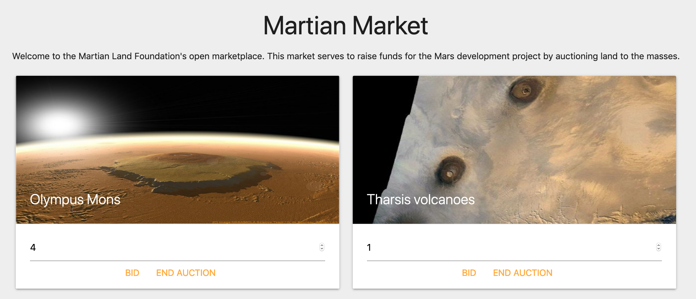
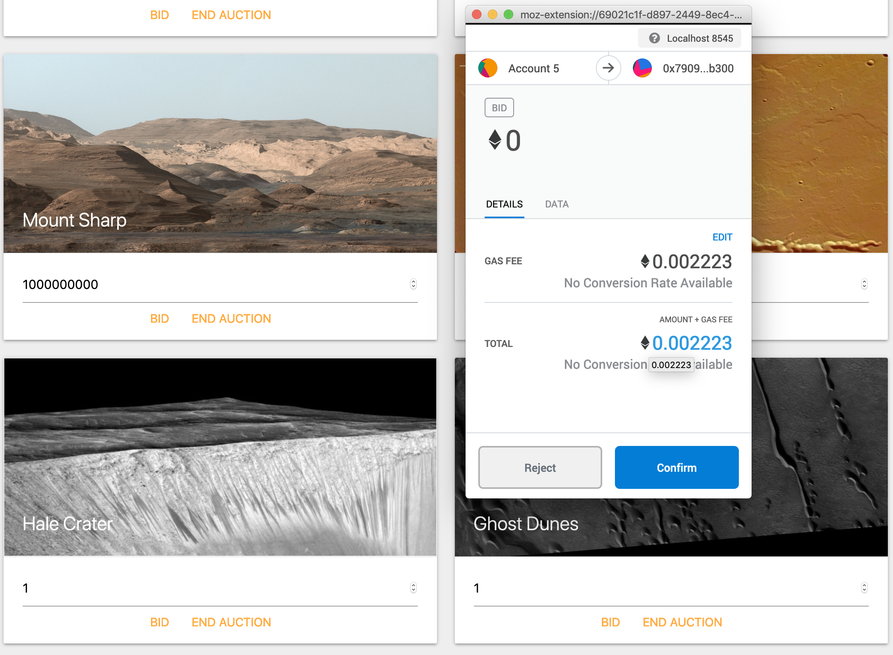
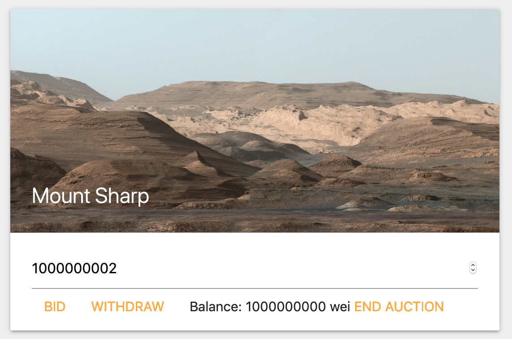
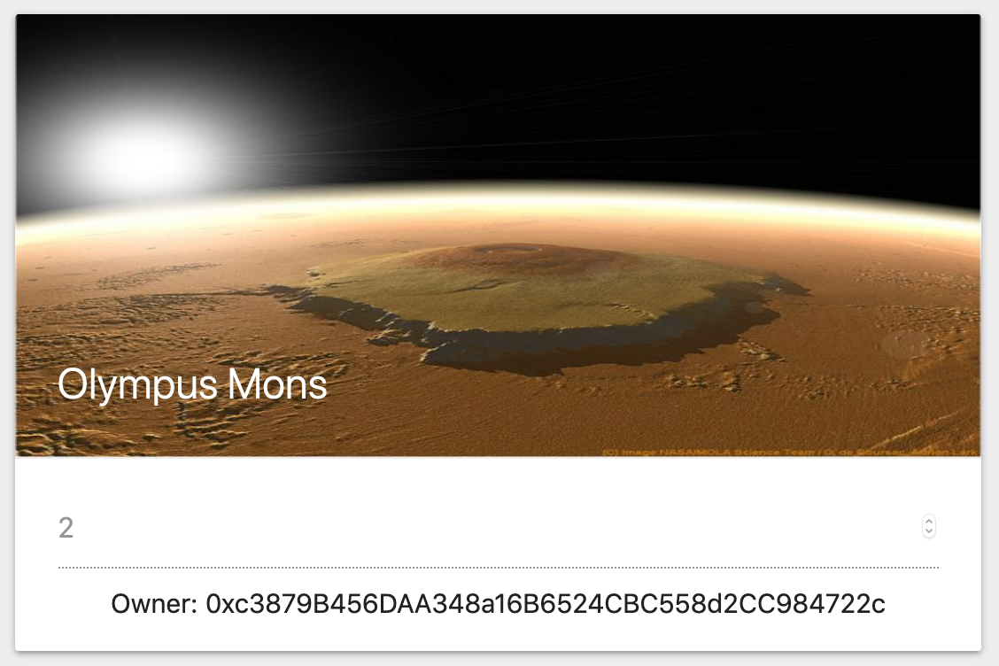
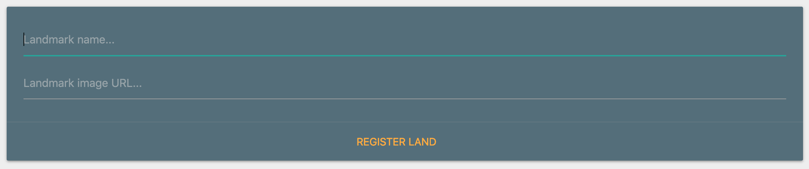

# Unit 22: We're going to Mars!

## Background

The Martian Development Foundation has asked you to develop a system to raise funds for Martian land development.
The system will be a combination of an ERC721 contract and an Auction contract combined to form the MartianMarket contract.

The foundation will be able to register new landmarks with their account, minting and creating a new auction for the landmark.
When the `endAuction` function is called, the auction will complete and the token will be transferred to the highest bidder.

The functions of the contract can be designed to have the foundation pay for the most expensive functions like`safeTransferFrom`.
This can be done by putting the token transfer in the `endAuction` function that only the foundation can call.

Each landmark will be a unique ERC721 token, with its own metadata including the landmark `name` and `image` URL.

Your frontend developer has already provided you the UI necessary for getting the job done, all you need to do is
implement the contracts. Good luck! Remember, you're building something few people have explored, so don't be afraid!

## Instructions

## Files

- [martian-market.zip](Starter-Code/martian-market.zip)

### Creating your project

You will need to unzip the `martian-market.zip` file and run an `npm install`.

There are scripts available for easy development, simply run `npm run dev` to launch the frontend.

This also supports `gh-pages` deployment, run `npm run deploy` against a Github Pages repo to deploy the frontend.

Initialize the project against a new Github repo and ensure your developer environment is properly setup.

### Designing the contracts

#### MartianAuction

The included `MartianAuction.sol` contract is a direct copy of the `SimpleAuction` contract from the
[Solidity documentation](https://solidity.readthedocs.io/en/v0.5.10/solidity-by-example.html?highlight=auction#id2).
You will need to modify this contract in the following ways:

- Remove the biddingTime functionality, ensuring the foundation can call end the auction any time

- Set `ended` as a `public` variable so the `MartianMarket` contract can access it with an automatic getter

- Change `msg.sender` in the `bid` function to a payable address parameter instead, to make it easier for the `MartianMarket`
  contract to call and to allow bidding on behalf of another address

- Add a `require` in `auctionEnd` that only allows the beneficiary to end the auction

#### MartianMarket

This contract will store an array of MartianAuctions in a mapping of tokenIds to MartianAuctions.
When the auction ends, the token ownership will be transferred to the highest bidder of the auction.

You will need to complete the functions provided in the starter code. Here are some tips for the main functions:

- In `endAuction`, you will need to end the auction, then perform a `safeTransferFrom`, transferring the token to the
  `auction.highestBidder()` from the `owner()`

- In the bid function, you will need to pass the `msg.value` to the function call to pass the ether to the auction.
  You can do this by adding `value(msg.value)` immediately before the parameter.
  It will look something like `auction.bid.value(msg.value)(msg.sender);`

- The rest of the functions are mostly just exposing the internal `MartianAuction` functions by fetching the auction by
  tokenId and calling the functions from that instance. The `getAuction` function is very useful and should be completed
  early.

- Make sure to include `require(_exists(tokenId), "error message here")` when possible, and other `requires` that will
  prevent lost ether or enforce security.

### Modifying the frontend code

You will need to update the `contractAddress` at the very top of `dapp.js`. This will ensure the frontend can communicate
with the smart contract backend. This will need to be consistent with the network the market is deployed on.

### Testing the Market

When you launch the market, you should see something like this:

You should import at least 2 private keys into MetaMask, the first being the deployer of the contracts and another other
to test non-admin features.

You should be able to bid on a token:

When you are out-bid, you should be able to withdraw your pending balance in escrow:

When you are using the foundation account in MetaMask, you should be able to end auctions as well.
This will then transfer the token to the highest bidder of the auction. You will see this as such:

You can also register new land using the foundation address:

### Deploying the Market

The migration scripts are provided here already. This means that once the contracts are properly implemented,
you can simply run `truffle deploy` and pass your desired network using the `--network` flag. We have included some
configuration for the Kovan and Ropsten networks, but feel free to use any other network as long as you designate in your submission.

You will also need to deploy this to Github Pages. Follow the same process as previous homeworks.
Remember to use the convenience package `gh-pages` by running `npm run deploy`. This will automatically publish the
bundle to the Github Pages repo you initialized in the beginning.

Deploying the contracts to a testnet or the mainnet will take a while, so don't worry if it looks like things are stalling.

### Submission

Once the dapp is live on Github Pages and accessible to the world, publish the code with a `README.md`.
Explain how the dapp works, and how it is built. Remember, the more details, the better.

Ensure that you have changed the `contractAddress` in the frontend code to be the address deployed on a live network.

## Celebrate

You have just created a system that few people in the world have ever even imagined! Just imagine all of the things you
can build now. By building this, you have flexed every Solidity muscle you can. You have proved to the world and to yourself
that you can build next generation financial technology!
