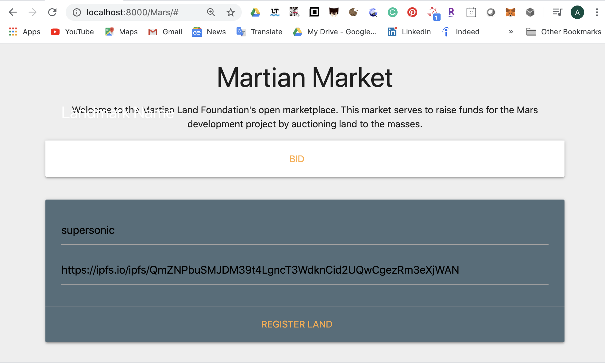
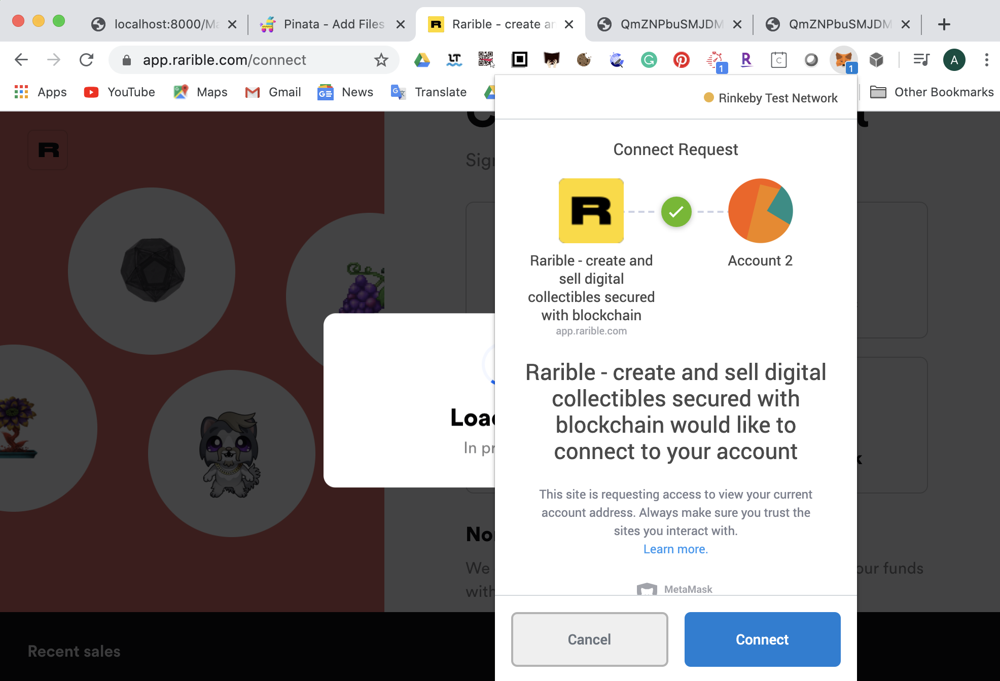
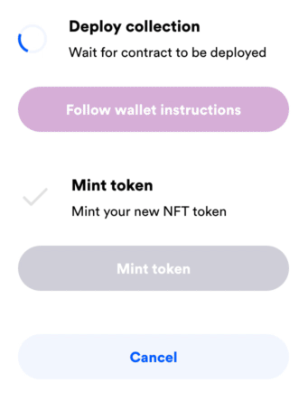
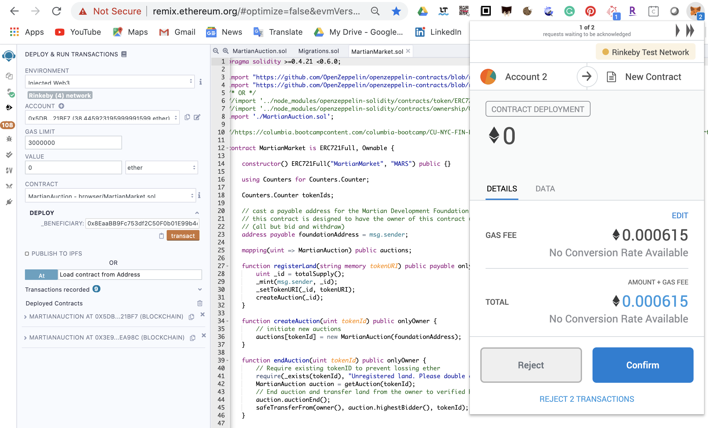
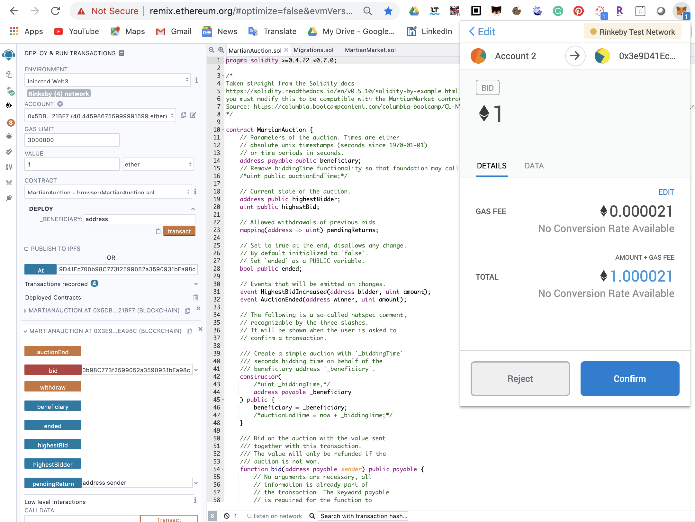
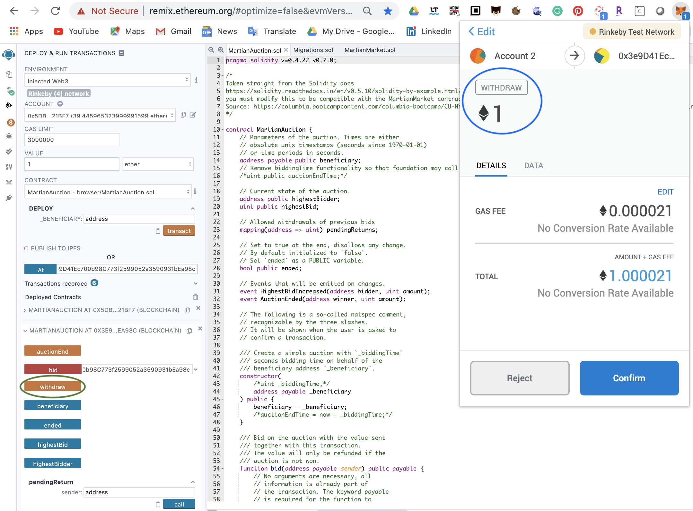
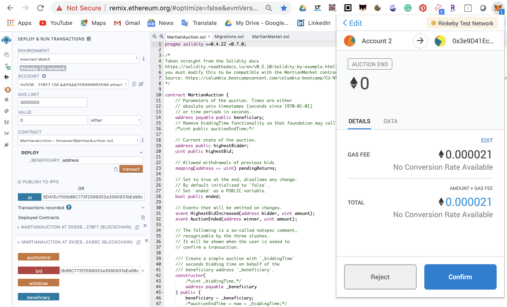
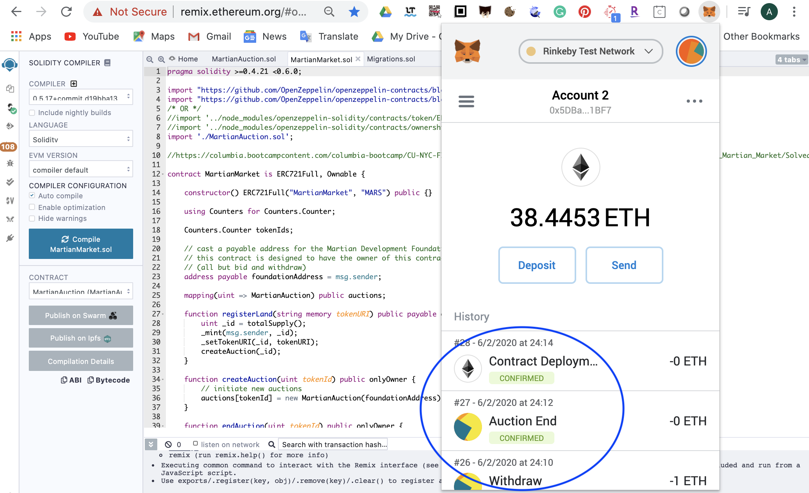

# **Supersonic Deals**

## _How would distributed ledgers scale in a different dimension?_

---


## **Files**

## _**[Solicity Smart Contracts](Mars/contracts)**_

## _**Blockchain Deals on Martian Land**_

### Designing the contracts

#### A. [MartianAuction](Mars/contracts/MartianAuction.sol)

Modified from:
[Solidity documentation](https://solidity.readthedocs.io/en/v0.5.10/solidity-by-example.html?highlight=auction#id2).

#### B. [MartianMarket](Mars/contracts/MartianMarket.sol)

#### C. [Migrations](Mars/contracts/Migrations.sol)

---

## **Deploying the Initiatives**

### _**[Supersonic Deals Web Page on Github](https://ava33343.github.io/Supersonic_Deals/)**_

<details><summary>
Webpage on Supersonic Deals
</summary>


</details>

<details><summary>
Step 1: Click on Settings on Github Repository on Supersonic_Deals.
</summary>


</details>

<details><summary>
Step 2: View on Settings tab:
</summary>


</details>

<details><summary>
Step 3: Scroll down to GitHub Pages section
</summary>

* Source: Select _master branch_ 
* Theme Chooser: Modernist here (you may absolutely select any theme as you wish!)


</details>

---

### _**Supersonic Bidding on Localhost: 8000**_

**Step 1: Type the following command in a terminal window**
```shell
python -m http.server 8000
```
<details><summary>
Allow for network connections on the pop-up window.
</summary>


</details>

**Step 2: Lauch a webpage on Chrome browser on localhost:8000**

_Click on **Mars** on the screen to reach the following page_


**Step 3: Mint Ethereum Tokens on Rarible** 

<details><summary>
followed by uploading featured pictures of land onto Pinata. Allow connection to account on MetaMask as shown below (click me):
</summary>



</details>


_Marketing options available upon minting_

---

### _**Transactions on Remix**_

<details><summary>
A. Deployment of MartianMarket Contract 
</summary>



</details>

<details><summary>
B. Bid of 1 Ether on MartianAuction Contract
</summary>



</details>

<details><summary>
C. Withdraw of 1 Ether on MartianAuction Contract
</summary>



</details>

<details><summary>
D. End Auction on MartianAuction Contract
</summary>



</details>

<details><summary>
E. Records on MetaMask
</summary>



</details>

---


## References

* Columbia University Fintech Bootcamp Repository
* [Solicity Documents](https://solidity.readthedocs.io/en/v0.5.10/solidity-by-example.html?highlight=auction#id2)
* [Github](https://github.com)
* [Pinata](https://pinata.cloud/pinexplorer)
* [Rarible Coin Mining](https://app.rarible.com/create/erc1155)
* [IPFS](https://ipfs.io/)
* [Remix](http://remix.ethereum.org/)