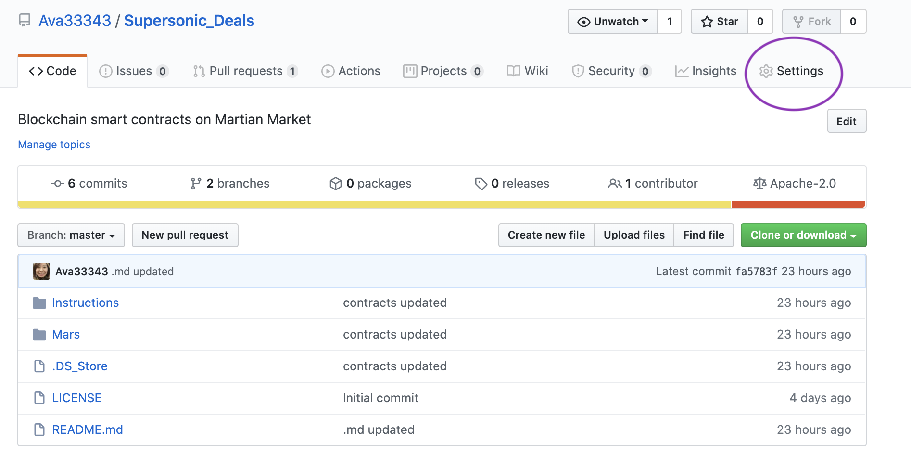
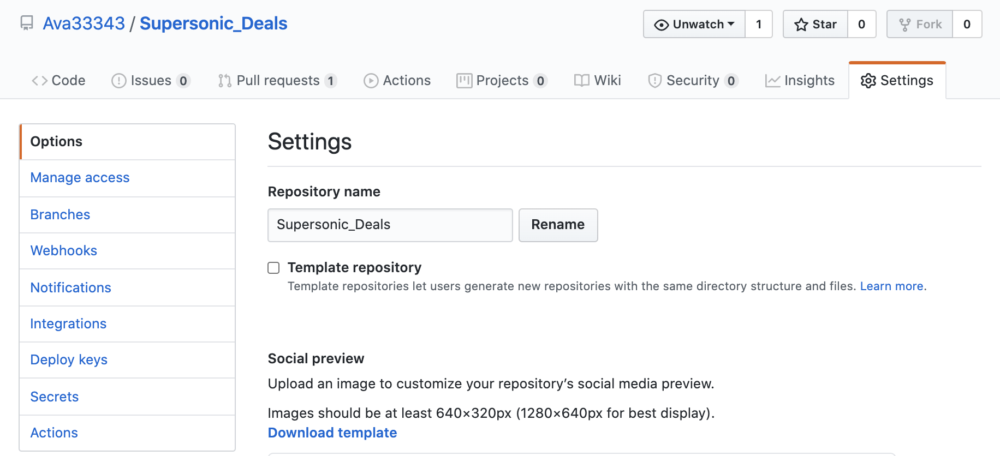
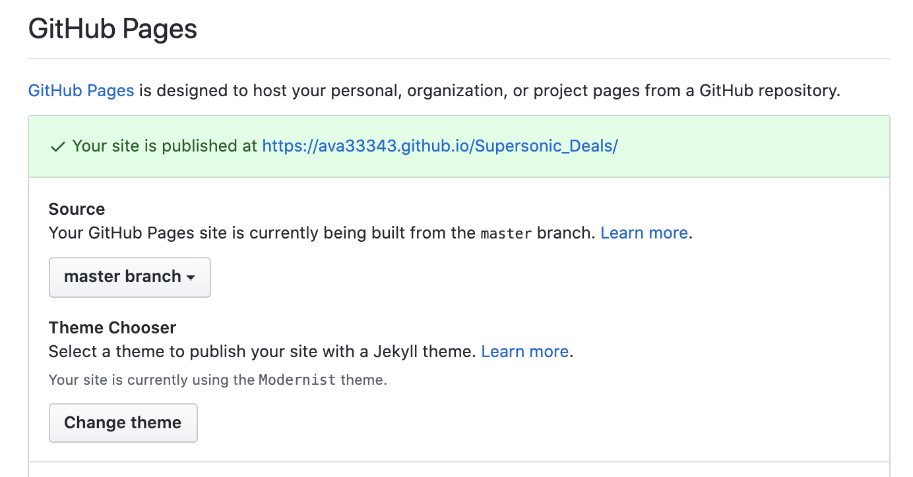

# **Supersonic Deals**

## _How would distributed ledgers scale in a different dimension?_

---

## **Files**

## _**[Solicity Smart Contracts](Mars/contracts)**_

## _**Blockchain Deals on Martian Land**_

### Designing the contracts

#### A. [MartianAuction](Mars/contracts/MartianAuction.sol)

Modified from:
[Solidity documentation](https://solidity.readthedocs.io/en/v0.5.10/solidity-by-example.html?highlight=auction#id2).

#### B. [MartianMarket](Mars/contracts/MartianMarket.sol)

#### C. [Migrations](Mars/contracts/Migrations.sol)

### Deploying the Initiatives

### _**[Supersonic Deals Web Page on Github](https://ava33343.github.io/Supersonic_Deals/)**_

Webpage on Supersonic Deals

Step 1: Click on **Settings** on Github Repository on _Supersonic_Deals_.

Step 2: View on **Settings** tab:

Step 3: Scroll down to **GitHub Pages** section

* Source: Select _master branch_ 
* Theme Chooser: Modernist here (you may absolutely select any theme as you wish!)

_To be continued..._

## References

* Columbia University Fintech Bootcamp Repository
* [Solicity Documents](https://solidity.readthedocs.io/en/v0.5.10/solidity-by-example.html?highlight=auction#id2)
* [Github](https://github.com)